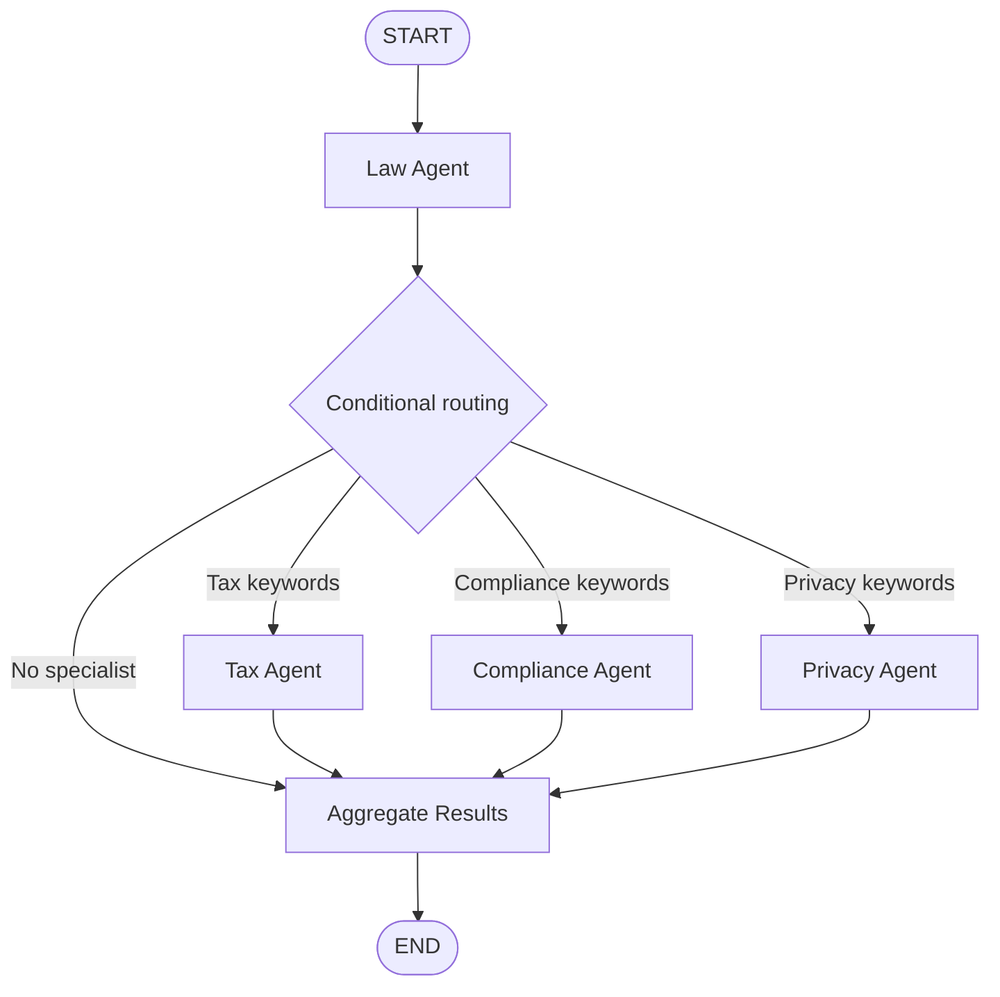

# Stage 4 In-Process Multi-Agent Graph

```mermaid
flowchart TD
    START([START]) --> LAW[Law Agent]
    LAW --> ROUTE{Conditional routing}
    ROUTE -->|Tax keywords| TAX[Tax Agent]
    ROUTE -->|Compliance keywords| COMPLIANCE[Compliance Agent]
    ROUTE -->|Privacy keywords| PRIVACY[Privacy Agent]
    ROUTE -->|No specialist| AGGREGATE[Aggregate Results]
    TAX --> AGGREGATE
    COMPLIANCE --> AGGREGATE
    PRIVACY --> AGGREGATE
    AGGREGATE --> END([END])
```

Tax, Compliance, and Privacy are dispatched with LangGraph `Send` objects and
can execute in parallel when more than one routing condition matches.
