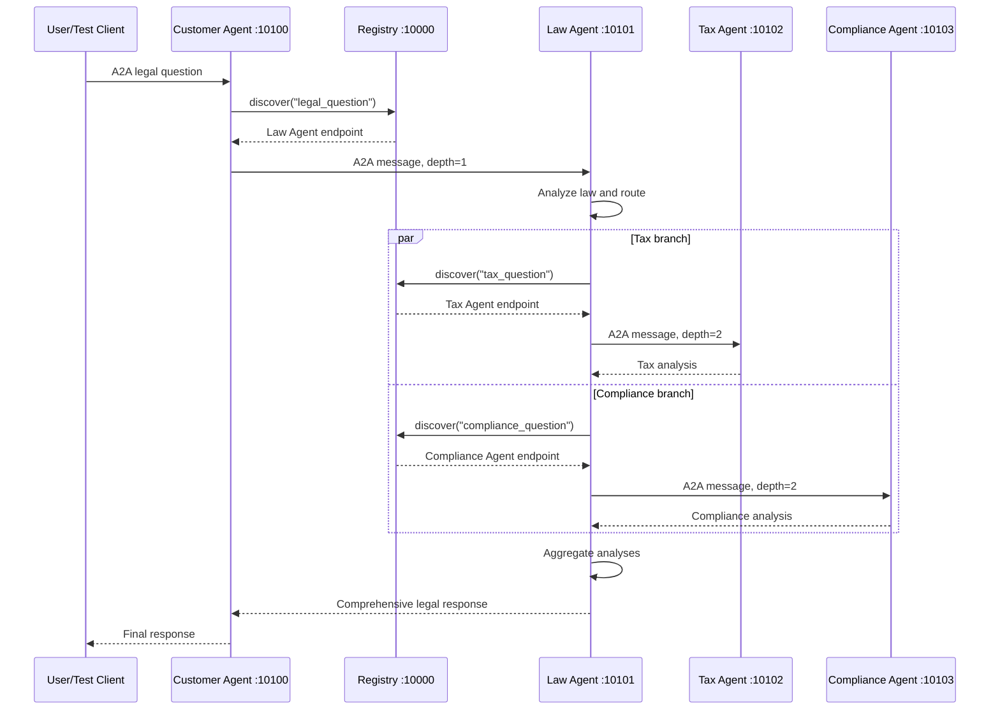

# Stage 5 A2A Request Sequence

The same `trace_id` and `context_id` are propagated through every A2A hop.
The verified E2E request completed in 44.21 seconds with Tax and Compliance
running concurrently.
